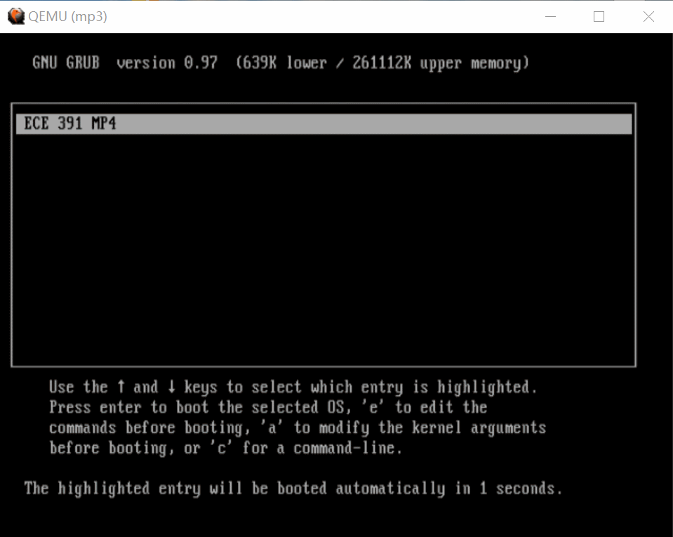
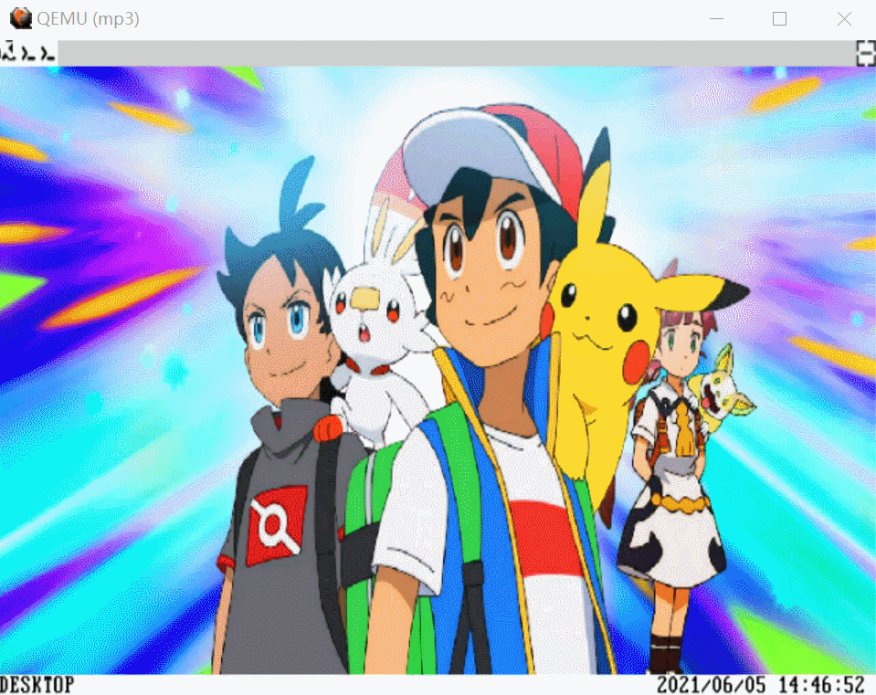
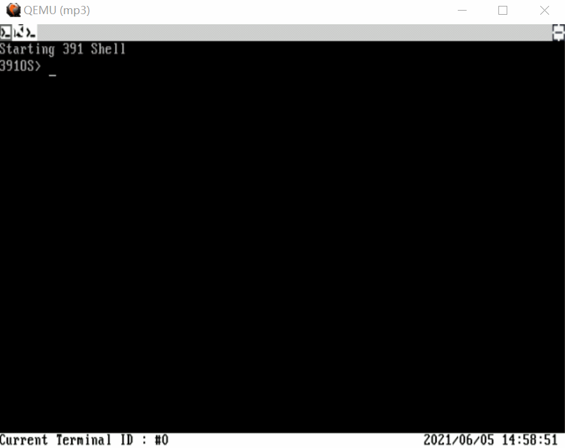
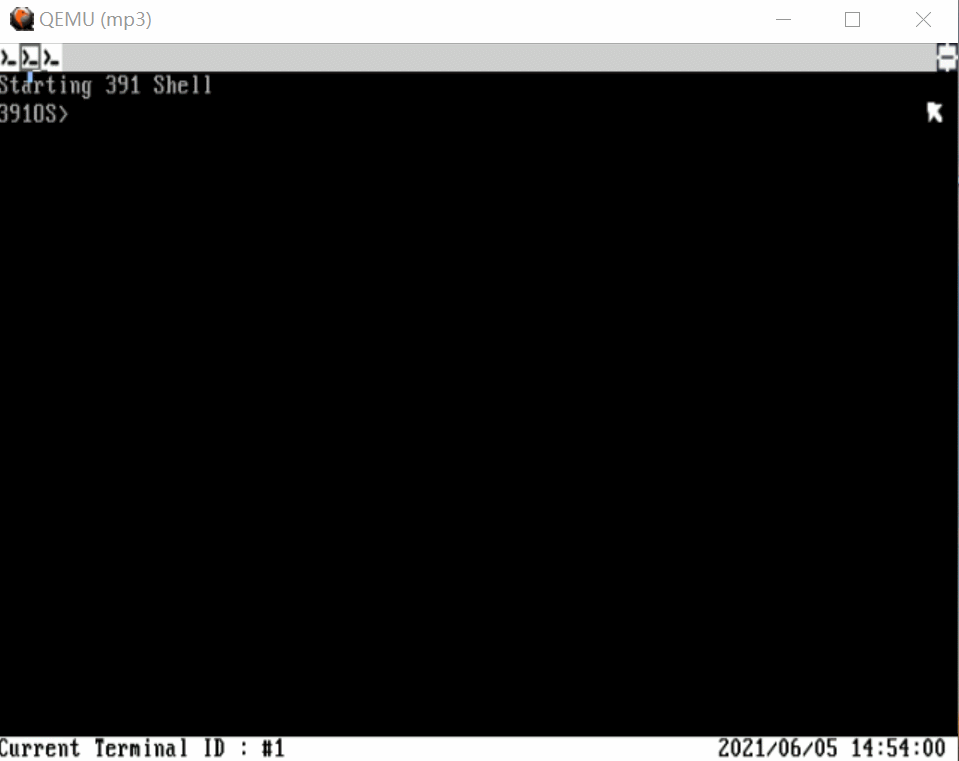

This is the final project for my ECE391 course taken in UIUC. I am fortunated to work with wonderful teammates: Jiaqi Lou, Zhongbo Zhu and Tianyu Liu. In this project, we develop the core of an operating system.
If you want to take a look at the code, please visit: https://github.com/Alex-Lian/ECE-391-final-project
The following part are some demos.

---
### Boot Animation
we can also see the desktop and the status bar in the buttom with location and time.
   

---
### Cursor Display
The self-designed cursor can open a new terminal and close it smoothly.
   

---
### Terminal
The terimal can continue to run the program when it is minimized.
 
The terminal can support code completion and history buffer.
 

---
### Operation
 

---
### Signal
We can use “CRTL+C” to terminal the current program, which is the signal part in linux kernel.
 